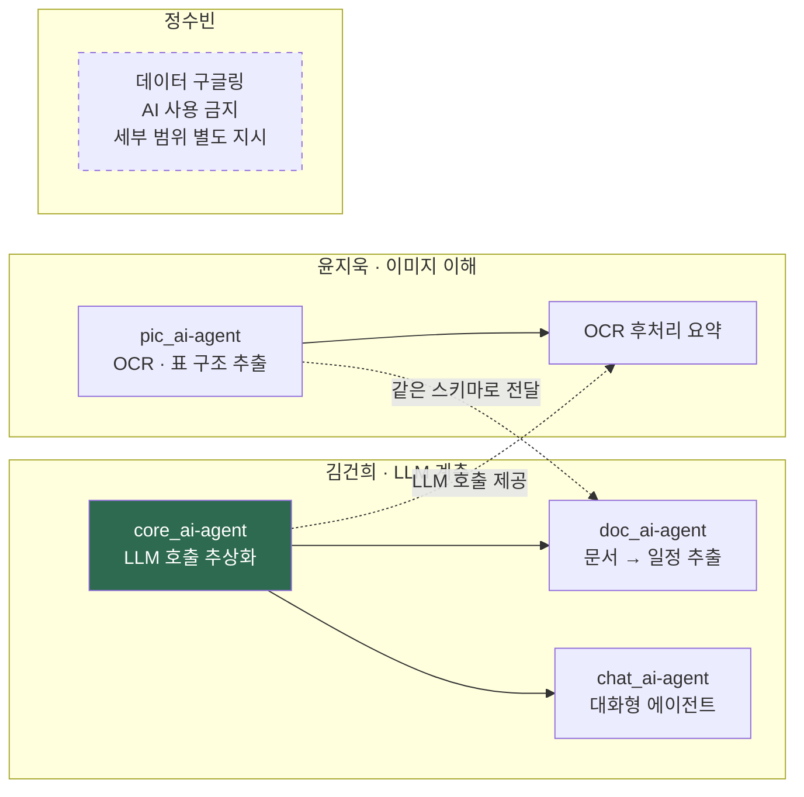
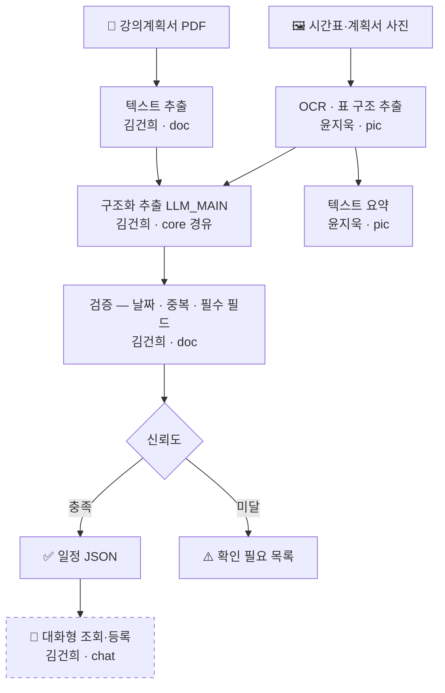
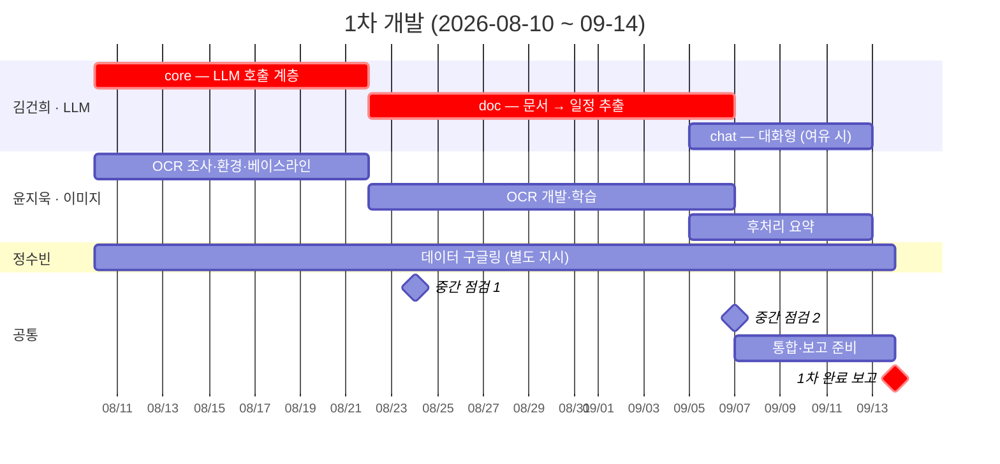
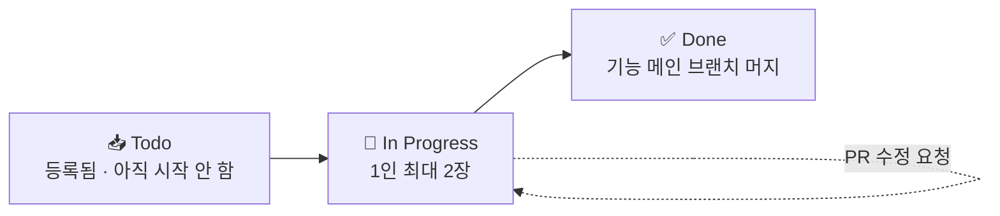

# 1차 개발 계획 (~2026-09-14)

> **이 문서는 전체 계획만 다룹니다.**
> 기능별 세부 계획은 각 담당자가 [`docs/plans/`](plans/) 아래에 직접 작성합니다. → [7장](#7-세부-계획은-담당자가-작성합니다)

| 항목 | 내용 |
| --- | --- |
| 목표 | **AI 1차 개발 완료 보고** |
| 마감 | **2026-09-14 (월)** |
| 기간 | 2026-08-10 (월) ~ 09-14 (월) — **5주** |
| 인원 | 3명 (윤지욱 · 정수빈 · 김건희) |
| 진행 방식 | 칸반 보드 + GitHub Issue |

---

## 목차

1. [진행 방식 — 무엇을 쓰고 무엇을 안 쓰나](#1-진행-방식--무엇을-쓰고-무엇을-안-쓰나)
2. [역할 분담](#2-역할-분담)
3. [필요한 기술 매핑](#3-필요한-기술-매핑)
4. [전체 그림 — 1차 개발 대상의 데이터 흐름](#4-전체-그림--1차-개발-대상의-데이터-흐름)
5. [일정](#5-일정)
6. [칸반 보드 운영 규칙](#6-칸반-보드-운영-규칙)
7. [세부 계획은 담당자가 작성합니다](#7-세부-계획은-담당자가-작성합니다)
8. [1차 범위에서 제외하는 것](#8-1차-범위에서-제외하는-것)
9. [9/14 보고 준비물](#9-914-보고-준비물)
10. [미결 사항 — 9/14 회의 안건](#10-미결-사항--914-회의-안건)
11. [리스크](#11-리스크)

---

## 1. 진행 방식 — 무엇을 쓰고 무엇을 안 쓰나

애자일을 **전부 도입하지 않습니다.** 3명 규모에서 형식이 과하면 개발보다 회의가 커집니다.
쓸 것과 안 쓸 것을 먼저 못박습니다.

| 요소 | 도입 | 어떻게 |
| --- | :---: | --- |
| **칸반 보드** | ✅ | GitHub Projects. 이슈가 카드가 되어 컬럼을 이동합니다 |
| **이슈 = 백로그 단위** | ✅ | `.github/ISSUE_TEMPLATE/task.md` 로 등록. 완료 기준을 반드시 적습니다 |
| **스프린트 리뷰·회고** | ✅ | **9/14 (월) 1회.** 1차 결과를 함께 보고 다음 주기를 그때 정합니다 |
| **주 단위 스프린트 구분** | ❌ | 1차 기간은 **끊지 않고 통짜로** 갑니다 |
| **데일리 스크럼 (모여서 말하기)** | ❌ | **이슈 코멘트로 대체.** 아래 설명 |
| **스토리 포인트 · 번다운 차트** | ❌ | 3명 규모에서 관리 비용이 산출물보다 큽니다 |

### 왜 스프린트를 안 끊나

칸반은 원래 **타임박스가 없는 방식**입니다. 정해진 주기로 잘라 담는 스크럼과 달리,
일감이 컬럼을 따라 흐르게 두고 **막힌 곳을 드러내는** 데 목적이 있습니다.

1차 기간은 각자 처음 만드는 것이라 작업 크기를 예측하기 어렵습니다.
지금 주 단위로 끊으면 **매주 "못 끝냄"만 반복 확인**하게 됩니다.
그래서 1차는 흐름으로 관리하고, **9/14에 실제 속도를 본 뒤** 스프린트 주기를 정합니다.

### 데일리 스크럼을 이슈로 대체하는 방법

모여서 말하는 대신, **자기 이슈에 코멘트를 남깁니다.** 내용은 스크럼 3질문 그대로입니다.

```text
- 지난번 이후: 강의계획서 5건 중 3건에서 마감일 추출 성공
- 다음: 표 형태 PDF 대응
- 막힌 것: 표가 줄글로 뭉개짐 → DOC_PARSER 붙여볼 예정
```

- **최소 주 2회**는 남깁니다. 진행이 없어도 "진행 없음 + 이유"를 적습니다.
- 하루 이상 막히면 **`blocked` 라벨**을 답니다. 그 이슈부터 같이 봅니다.
- 카톡으로 물었으면 **답을 이슈 코멘트로 옮겨 적습니다.** (README 6장 규칙)

> 카톡은 검색이 안 되고 스크롤에 묻힙니다. 이슈에 남긴 것만 두 달 뒤에 찾을 수 있습니다.

---

## 2. 역할 분담

| 담당 | 맡은 일 | 모듈 (기능 메인 브랜치) | 대응 기능 |
| --- | --- | --- | --- |
| **윤지욱** | OCR 개발·학습, OCR 결과 텍스트 요약 | `pic_ai-agent` | F1·F6 의 **이미지 입력 경로** (DF-1) |
| **정수빈** | 데이터 구글링해오기 (**AI 사용 금지**) | — | — |
| **김건희** | LLM 호출 계층, 문서→일정 추출, 대화형 에이전트 | `core_ai-agent` → `doc_ai-agent` → `chat_ai-agent` | 4.3 나(core) · F1·F6(doc) · F9(chat) |

개인 작업 브랜치는 `<기능약어>_ai-agent_<영문이름>` 입니다. (README 4장)



> 진한 칸(`core_ai-agent`)이 **다른 사람이 기다리는 산출물**입니다.
> 윤지욱의 요약도 `core`를 거치므로, 여기가 늦으면 두 사람이 멈춥니다.

### 정수빈 담당에 대한 메모

- 맡은 일은 **데이터 구글링해오기**이며, **AI 사용은 금지**입니다.
- **이 저장소의 9개 AI 기능 모듈과의 대응은 아직 정하지 않았습니다.** 별도로 지시된 작업입니다.
- 어떤 데이터를, 어떤 형식으로, 어디에 둘지는 **김건희가 따로 전달**합니다.
- 저장소에 산출물을 올릴 일이 생기면 그때 `data/` 규칙(README 8장, `.gitignore`)을 따릅니다.

> 위 점선 표시는 **아직 파이프라인에 연결되지 않았다**는 뜻입니다. 빠졌다는 뜻이 아닙니다.
> 연결 지점이 정해지면 이 문서를 갱신합니다. ([미결 사항 1번](#10-미결-사항--914-회의-안건))

---

## 3. 필요한 기술 매핑

각자 맡은 일에 **어떤 기능·모델 슬롯·패키지가 필요한지** 정리했습니다.
모델 슬롯이 무엇인지는 [docs/AI_MODULES.md](AI_MODULES.md)를 보세요.

### 윤지욱 — `pic_ai-agent`

| 항목 | 내용 |
| --- | --- |
| **대응 기능** | F1·F6 의 이미지 입력 경로 · 데이터 흐름 **DF-1** 의 2단계 |
| **모델 슬롯** | `DOC_PARSER` (레이아웃·표 인식) → 부족할 때만 `VISION` · 요약에 `LLM_MAIN` |
| **입력 / 출력** | 시간표·강의계획서 사진 1장 → 텍스트 + 표 구조 JSON |
| **필요 기술** | OCR 추론·파인튜닝, 이미지 전처리(기울기·대비), 표 구조 복원, 실패 감지 |
| **패키지** | `torch` `transformers` `timm` `accelerate` `opencv-python-headless` `einops` → [requirements-gpu.txt](../requirements-gpu.txt) |
| **GPU** | **필요.** 로컬 OCR 학습은 GPU 없이는 못 합니다 |
| **의존** | `core_ai-agent` (요약 호출) ← 김건희 |

> ### ⚠️ GPU 메모리를 먼저 확인하세요
> 학교 서버는 A100 80GB를 **MIG로 쪼개서** 나눠줍니다. 실측 결과 할당된 슬라이스는 `1g.10gb`,
> **실제 쓸 수 있는 VRAM은 약 9.5GiB** 입니다. 80GB가 아닙니다.
>
> ```bash
> nvitop -1    # 할당된 슬라이스 확인
> ```
>
> 9.5GiB에서 큰 모델 풀 파인튜닝은 불가능합니다. **LoRA 같은 경량 학습이나 작은 모델**로 잡으세요.
> 이 판단을 세부 계획서에 **근거와 함께** 적어주세요.

**주의** — 출력은 `doc_ai-agent`와 **같은 스키마**여야 합니다. 그래야 뒷단(검증·저장)을 공유합니다.
스키마는 김건희와 먼저 맞추세요. ([인터페이스 계약](AI_MODULES.md) `추출 출력 스키마`)

### 정수빈 — 데이터 구글링

| 항목 | 내용 |
| --- | --- |
| **맡은 일** | 데이터 구글링해오기 |
| **제약** | **AI 사용 금지** |
| **대응 기능 / 모듈** | 미정 — 별도 지시 작업 |
| **모델 슬롯** | 없음 |
| **패키지** | 없음 |
| **GPU** | 불필요 |

수집 대상·형식·산출물 위치는 김건희가 별도로 전달합니다.
정해지면 이 표와 [4장 그림](#4-전체-그림--1차-개발-대상의-데이터-흐름)을 갱신합니다.

### 김건희 — `core` → `doc` → `chat`

| 순서 | 모듈 | 대응 기능 | 모델 슬롯 | 필요 기술 |
| :---: | --- | --- | --- | --- |
| 1 | `core_ai-agent` | 계획서 4.3 나·라 | — | OpenAI 호환 호출 추상화, 스키마 검증·재시도, 프롬프트 파일화, 토큰 로깅, 응답 캐싱 |
| 2 | `doc_ai-agent` | **F1 · F6** (DF-1) | `LLM_MAIN` `DOC_PARSER` | PDF 텍스트 추출, 구조화 추출, 날짜·중복 검증, 저신뢰 분리 |
| 3 | `chat_ai-agent` | **F9** (DF-4) | `LLM_MAIN` | Function Calling, 도구 정의, 읽기/쓰기 분기, 상대 날짜 해석 |

**패키지**: `openai` `pydantic` `pydantic-settings` `tenacity` `pypdf` `python-dateutil` → [requirements.txt](../requirements.txt) · **GPU 불필요**

> ### 순서를 바꾸지 마세요
> `core`는 **윤지욱도 기다리는 코드**입니다. OCR 후처리 요약이 `core`를 거칩니다.
> `core`가 늦으면 두 사람이 멈추므로 **가장 먼저, 가장 확실하게** 끝내야 합니다.
>
> `chat`은 셋 중 마지막입니다. 일정이 밀리면 **`chat`을 먼저 잘라냅니다.** ([8장](#8-1차-범위에서-제외하는-것))

---

## 4. 전체 그림 — 1차 개발 대상의 데이터 흐름

[기능명세서 DF-1](../Univ-Us_기능명세서.md)에서 **1차에 실제로 만드는 구간**과 담당자를 표시했습니다.



- **점선 테두리**(`chat`)는 일정이 밀리면 잘라내는 구간입니다.
- 이 그림 **바깥은 1차 범위가 아닙니다.** ([8장](#8-1차-범위에서-제외하는-것))
- 입력 문서(맨 위 두 칸)를 **어디서 구할지는 각자 정합니다.** 정수빈 담당 작업과의 연결은 미정입니다.

---

## 5. 일정

스프린트로 끊지 않습니다. 아래는 **점검 시점**과 대략의 흐름입니다.



| 시점 | 무엇을 확인하나 |
| --- | --- |
| **8/24 (월) 중간 점검 ①** | `core` 가 호출되는가 · OCR 베이스라인이 도는가 |
| **9/07 (월) 중간 점검 ②** | 각자 MVP 완료 기준이 몇 개 체크됐는가 · **여기서 `chat` 포함 여부를 결정** |
| **9/14 (월) 1차 완료 보고** | 데모 + [스프린트 회의](#1-진행-방식--무엇을-쓰고-무엇을-안-쓰나) (리뷰·회고·다음 주기 결정) |

> 위 막대는 **약속이 아니라 기준선**입니다. 실제 진행은 칸반 보드가 보여줍니다.
> 막대와 어긋나기 시작하면 그때 조정하되, **조정했다는 사실을 이슈에 남기세요.**

---

## 6. 칸반 보드 운영 규칙

보드: **[Univ-Us_AI_칸반보드](https://github.com/users/logan0741/projects/4)** (Projects #4)

GitHub 기본 3컬럼을 그대로 씁니다. 컬럼을 늘리는 대신 **규칙과 라벨로** 나머지를 다룹니다.



| 컬럼 | 여기 있으려면 |
| --- | --- |
| **Todo** | 이슈로 등록된 상태. 아직 아무도 손대지 않음 |
| **In Progress** | 내가 맡아서 진행 중. 코드 작성·PR 리뷰 대기 **모두 포함**. **1인 동시 2장까지** |
| **Done** | 기능 메인 브랜치에 **머지 완료** |

### 컬럼이 3개라서 생기는 두 가지 보완

컬럼을 5개(`Backlog / Ready / In Progress / Review / Done`)로 나누지 않기로 했습니다.
3명 규모에서 컬럼이 많으면 옮기는 것 자체가 일이 됩니다. 대신 빠진 두 개념을 이렇게 다룹니다.

| 빠진 컬럼 | 무엇을 하려던 것인가 | 어떻게 대신하나 |
| --- | --- | --- |
| `Ready` | 완료 기준 없이 시작하는 것을 막음 | **Todo → In Progress 로 옮기기 전에 이슈의 완료 기준을 확인한다.** 비어 있으면 먼저 채운다 |
| `Review` | 리뷰 대기 중인 것을 구분 | 보드의 **`Linked pull requests` 필드**로 보입니다. PR이 걸린 카드 = 리뷰 대기 |

> PR을 올려도 카드는 **In Progress에 남습니다.** 그래서 리뷰가 밀리면 그 사람의 WIP 2장이 차서
> 새 일을 못 잡게 됩니다. 불편해 보이지만 의도한 것입니다 — **리뷰를 미루면 본인이 먼저 막힙니다.**

### 지킬 것 4가지

1. **카드는 곧 이슈입니다.** 보드에서 직접 만들지 말고 `[작업]` 템플릿으로 이슈를 등록하세요.
   이슈에는 완료 기준·입출력·모델 슬롯이 들어갑니다. 보드 카드에는 그게 안 남습니다.
2. **In Progress 2장 제한.** 벌려놓기만 하고 끝나는 게 없는 상태를 막습니다.
   3장째를 시작하고 싶으면, 먼저 하나를 머지까지 끝내세요.
3. **막히면 `blocked` 라벨.** 컬럼을 옮기지 말고 라벨을 답니다. 하루 이상 혼자 붙잡지 않습니다.
4. **Done의 기준은 "머지"입니다.** "코드는 다 짰는데 PR은 아직"도, "PR은 올렸는데 리뷰 대기"도
   여전히 In Progress입니다.

### 시작할 때 (복붙용)

```bash
# 1) 보드에서 내 카드를 In Progress 로 옮기기 전에 — 이슈의 완료 기준이 비어 있지 않은지 확인
# 2) 이슈에 나를 assignee 로 지정
# 3) 작업 브랜치 생성 (README 4장)
git switch <기능약어>_ai-agent
git switch -c <기능약어>_ai-agent_<영문이름>
```

### 이슈를 쪼개는 크기

**하나의 이슈는 2~3일 안에 끝나는 크기**로 자릅니다.

```text
❌ 너무 큼:  "OCR 개발"
✅ 적당함:  "시간표 사진에서 표 구조를 JSON으로 뽑기"
            "기울어진 사진 실패 감지해서 '확인 필요'로 분리하기"
```

일주일 넘게 In Progress에 머무는 카드는 **쪼개야 한다는 신호**입니다.

---

## 7. 세부 계획은 담당자가 작성합니다

이 문서는 **전체 계획까지만** 다룹니다.
"어떤 모델을 쓸지, 어떤 순서로 만들지, 무엇으로 성공을 판정할지"는 **담당자가 정해서 문서로 올립니다.**

| | |
| --- | --- |
| **어디에** | [`docs/plans/`](plans/) 아래 |
| **파일명** | `<기능약어>_<영문이름>.md` (예: `pic_jiwook.md`) |
| **템플릿** | [`docs/plans/_TEMPLATE.md`](plans/_TEMPLATE.md) 를 복사해서 씁니다 |
| **언제까지** | **첫 코드를 쓰기 전에.** 늦어도 8/17 (월) |
| **어떻게 올리나** | 자기 작업 브랜치에서 커밋 → PR (코드와 같은 절차) |

> ### 왜 각자 쓰나
> 맡은 기능의 기술 판단은 그 사람이 가장 많이 압니다.
> 계획을 남이 대신 써주면 **왜 그렇게 정했는지가 사라지고**, 막혔을 때 되돌아볼 근거가 없습니다.
>
> 계획서는 잘 쓰는 게 목적이 아니라 **일주일 뒤의 자신이 읽고 이어가는 것**이 목적입니다.
> 정하지 못한 건 "미정"이라고 쓰면 됩니다. 빈칸으로 두는 것보다 훨씬 낫습니다.

---

## 8. 1차 범위에서 제외하는 것

**안 만드는 것을 정하는 게 만드는 것을 정하는 것만큼 중요합니다.**

| 제외 대상 | 이유 |
| --- | --- |
| `rag_ai-agent` (F4) | 벡터 색인·검색·출처 표기까지 필요. 단일 기능 중 공수 최대 |
| `brief_ai-agent` (F10) | `doc` 결과가 쌓여야 의미가 있음 |
| `notice_ai-agent` (F11~F13) | 게시판마다 수집기를 따로 만들어야 함 |
| `rule_ai-agent` (F2·F3·F5·F7·F8·F14·F16) | 계산 대상 데이터가 아직 없음 |
| `eval_ai-agent` (테스트셋 50건·정확도 자동 산출) | **1차에 담당자를 배정하지 않았습니다.** 인수 기준 90% 측정은 2차로 넘깁니다 |
| F15 맛집 · F17 사업단 플랫폼 | 🚫 백엔드 저장소 담당 |

### 잘라낼 순서

일정이 밀리면 **아래 순서로 잘라냅니다.** 급할 때 무엇부터 버릴지 미리 정해둡니다.

1. `chat_ai-agent` (F9) — 데모에서 화려하지만, 없어도 `doc` 결과는 보여줄 수 있습니다
2. OCR **학습(파인튜닝)** — 기성 모델·API 경로로 대체하고 정확도만 기록합니다

> **`core`와 `doc`은 자르지 않습니다.** 이 둘이 없으면 1차 보고에서 보여줄 것이 없습니다.

---

## 9. 9/14 보고 준비물

| 준비물 | 담당 | 판정 기준 |
| --- | --- | --- |
| **동작 데모** | 윤지욱 · 김건희 | 강의계획서(PDF·사진)를 넣으면 → 일정 JSON이 나오는 것을 **실제로 실행해서** 보여줍니다 |
| 샘플 검수 결과 | 김건희 | 샘플 강의계획서 **5건**에서 마감일이 수동 검수 결과와 일치하는가 ([AI_MODULES](AI_MODULES.md) `doc` 완료 기준) |
| OCR 결과 | 윤지욱 | 사진 5장에서 과목명·요일·시간이 나오는가 · 실패 감지가 되는가 |
| 데이터 구글링 결과 | 정수빈 | 별도 지시받은 범위 기준 |
| 각자 세부 계획서 | 전원 | `docs/plans/` 에 올라와 있고, 실제 진행과 어긋난 부분이 갱신돼 있을 것 |
| 칸반 보드 | 전원 | Done 컬럼이 채워져 있고, 남은 카드의 사유가 적혀 있을 것 |

> **인수 기준의 "정확도 90%"는 1차 판정 대상이 아닙니다.** 테스트셋 50건과 자동 측정이 필요한데
> `eval_ai-agent`를 1차 범위에서 뺐기 때문입니다. 1차에서는 **샘플 5건 수동 검수**까지만 봅니다.

> ### 안 되는 것을 숨기지 마세요
> 1차 완료 보고는 **"다 됐습니다"를 말하는 자리가 아니라** 어디까지 됐고 무엇이 막혔는지 공유하는 자리입니다.
> 5건 중 2건만 맞았으면 **2건이라고 적고 원인을 씁니다.** 그래야 다음 5주를 제대로 계획할 수 있습니다.
>
> 이건 [기능명세서](../Univ-Us_기능명세서.md)의 완성 기준 — *"문서상 설계가 아니라 실제로 동작하는 데모"* — 와 같은 이야기입니다.

---

## 10. 미결 사항 — 9/14 회의 안건

**아직 정하지 않았습니다.** 지금 임의로 정하지 말고 회의에서 함께 결정합니다.

| # | 안건 | 지금 상태 |
| :---: | --- | --- |
| 1 | **정수빈 담당 작업이 저장소의 어느 기능과 연결되는가** | 별도 지시 작업. 수집 대상·형식·산출물 위치를 김건희가 전달한 뒤 이 문서에 반영 |
| 2 | 스프린트 주기 (1주 / 2주 / 유지) | 1차 실제 속도를 보고 9/14에 결정 |
| 3 | 사용 모델 확정 (`LLM_MAIN` 등 5개 슬롯) | `eval_ai-agent` 비교 실험 후. 그때까지 코드에는 **슬롯 이름만** 씁니다 |
| 4 | **F5·F7·F14 의 AI 보조 역할을 어느 모듈이 맡을 것인가** | [AI_MODULES.md](AI_MODULES.md)에 `⚠️ 팀 확인 필요`로 표시만 해둔 상태. 1차 범위 밖이라 지금 결정할 필요 없음 |
| 5 | 각자의 `<영문이름>` 브랜치 표기 | 착수 전에 이슈로 공유 (README 4장) |
| 6 | 추출 출력 스키마 최종 형태 | **1차 진행 중 확정 필요.** 윤지욱·김건희가 먼저 맞추고 이슈로 공유 |

> 6번은 회의까지 미룰 수 없습니다. `pic`과 `doc`이 같은 스키마를 써야 뒷단을 공유합니다.
> **8월 중에** 임시 형태라도 정해서 이슈에 올리세요.

---

## 11. 리스크

| 리스크 | 영향 | 대응 |
| --- | --- | --- |
| **`core` 지연** | 김건희·윤지욱 동시 정지 | 최우선 작업. 8/24 점검에서 안 되면 즉시 공유하고 범위를 줄입니다 |
| **GPU VRAM 9.5GiB 제약** | OCR 학습 불가 | LoRA·소형 모델로 전환. 그래도 안 되면 기성 모델·API 경로 ([8장](#8-1차-범위에서-제외하는-것) 잘라낼 순서 2번) |
| **개발 환경이 pod 재시작 시 소멸** | 재설치 시간 손실 | 설치 스크립트를 남겨두고, 오래 걸리는 작업은 결과물을 영구 경로에 저장 |
| **스키마 합의 지연** | `pic` 결과를 `doc`이 못 받음 | 미결 6번. 임시 형태로 먼저 시작합니다 |
| **입력 문서 확보 지연** | 정확도 확인 불가 | 각자 **5건이라도** 먼저 확보해 파이프라인을 돌려봅니다 |
| **처음 쓰는 도구에서 시간 소모** | 개발 시간 잠식 | 하루 이상 막히면 `blocked` 라벨. 혼자 붙잡지 않습니다 |

---

## 참고 문서

| 문서 | 언제 보나 |
| --- | --- |
| [README](../README.md) | 브랜치·커밋·이슈·PR 규칙, 환경 설치 |
| [Univ-Us_기능명세서.md](../Univ-Us_기능명세서.md) | 내가 만드는 기능의 요구사항·인수 기준 |
| [Univ-Us_역할별_기능분해서.md](../Univ-Us_역할별_기능분해서.md) | AI/BE/FE 경계, 인터페이스 계약 |
| [docs/AI_MODULES.md](AI_MODULES.md) | **내 기능의 MVP 완료 기준** — 착수 전 필독 |
| [docs/plans/](plans/) | 각자의 세부 계획 |
